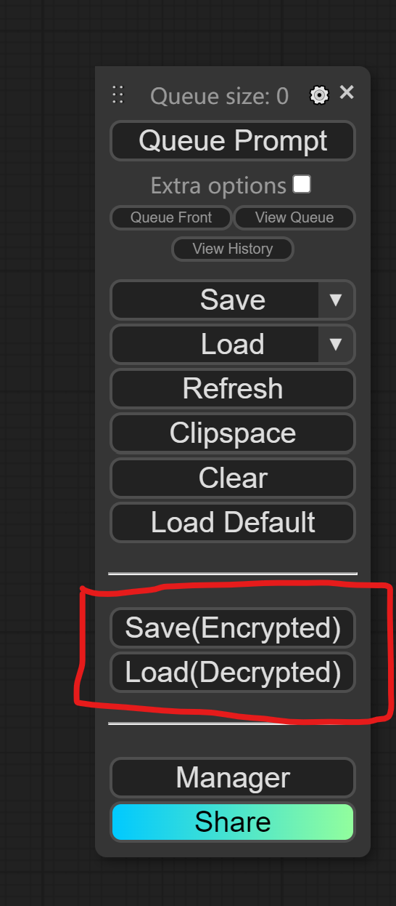
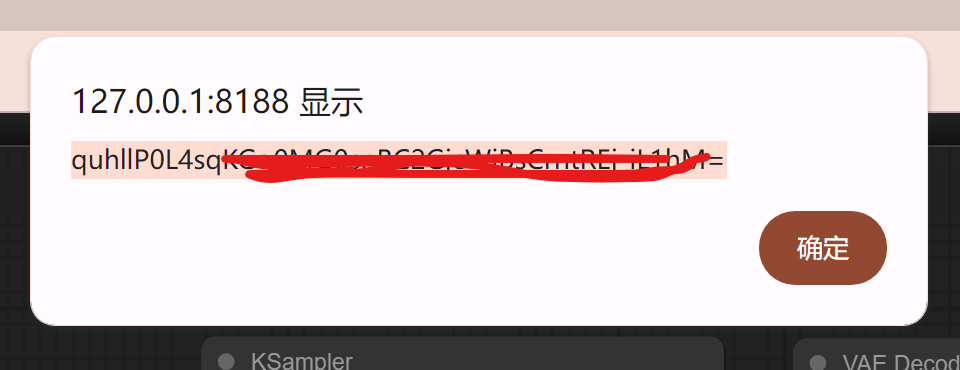
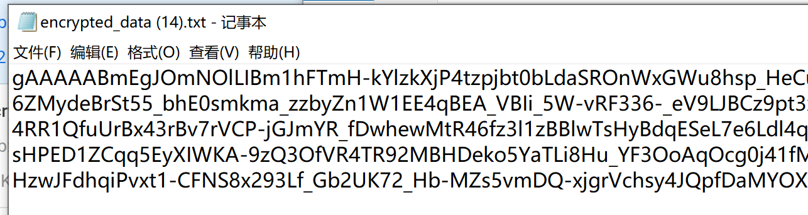
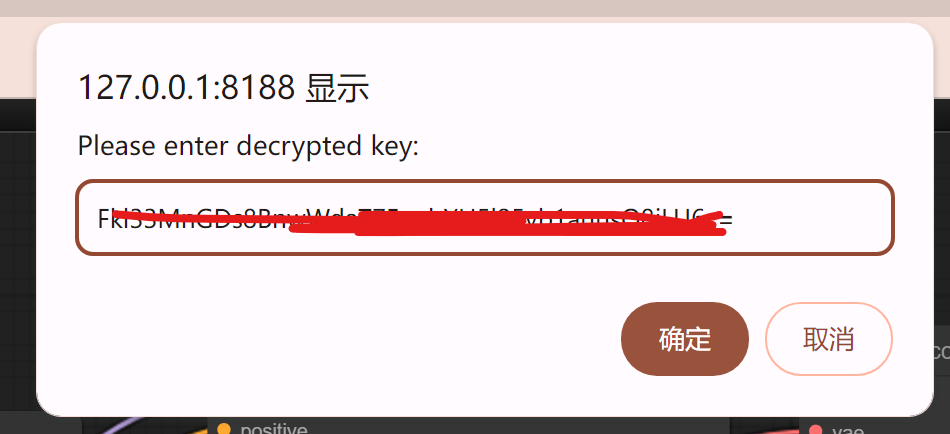
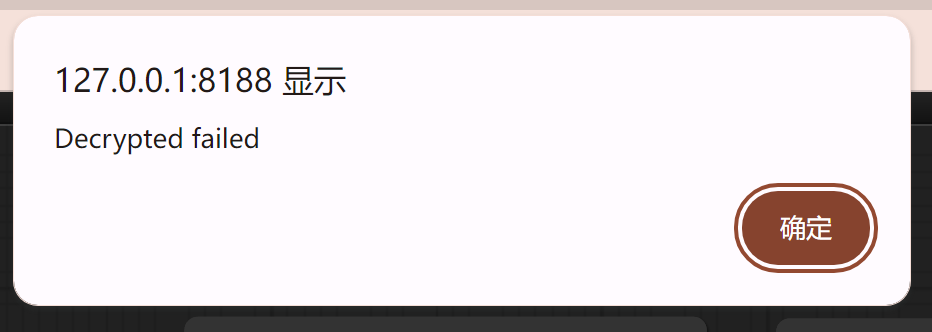

# ComfyUI Workflow Encrypt

**ComfyUI Workflow Encrypt** is an extension that enable you encrypt your workflow and share it with key.

## Installation

Just like you install other custom notes:

1. goto `ComfyUI/custom_nodes` dir in terminal(cmd)
2. `git clone https://github.com/jtydhr88/ComfyUI-Workflow-Encrypt`
3. Restart ComfyUI

## How to use

### Encrypted
1. Build your workflow first.
2. Click the Save(Encrypted) button.
3. Then the encrypted key will appear on your browser as well as your ComfyUI server console.
4. Please note, the key will ONLY be shown ONCE, so store the key carefully at this time.
5. Browser will download a file encrypted instead of viewable JSON file. 

### Decrypted
1. Share the encrypted file along with the key to others.
2. Install this extension on other's ComfyUI, restart.
3. Click the Load(Decrypted) button.
4. Copy and paste the key into the prompt.
5. Then choose the encrypted file.
6. If the key matches the file, ComfyUI should load the workflow correctly.
7. If the key doesn't match the file, absolutely, ComfyUI is unable to load it!

## Uninstall
If you don't want to reserve this extension, go to following two places to delete:
1. `ComfyUI/custom_nodes/ComfyUI-Workflow-Encrypt`
2. `ComfyUI/web/extensions/comfyui-workflow-encrypt`

## Backend implement
I am using [cryptography](https://cryptography.io/en/latest/) to implement

## Credit
ComfyUI/[ComfyUI](https://github.com/comfyanonymous/ComfyUI) - A powerful and modular stable diffusion GUI.

## My other extensions for stable diffusion webui
- [3D Model/pose loader](https://github.com/jtydhr88/sd-3dmodel-loader) A custom extension for AUTOMATIC1111/stable-diffusion-webui that allows you to load your local 3D model/animation inside webui, or edit pose as well, then send screenshot to txt2img or img2img as your ControlNet's reference image.
- [Canvas Editor](https://github.com/jtydhr88/sd-canvas-editor) A custom extension for AUTOMATIC1111/stable-diffusion-webui that integrated a full capability canvas editor which you can use layer, text, image, elements and so on, then send to ControlNet, basing on Polotno.
- [StableStudio Adapter](https://github.com/jtydhr88/sd-webui-StableStudio) A custom extension for AUTOMATIC1111/stable-diffusion-webui to extend rest APIs to do some local operations, using in StableStudio.
- [Txt/Img to 3D Model](https://github.com/jtydhr88/sd-webui-txt-img-to-3d-model) A custom extension for sd-webui that allow you to generate 3D model from txt or image, basing on OpenAI Shap-E.
- [3D Editor](https://github.com/jtydhr88/sd-webui-3d-editor) A custom extension for sd-webui that with 3D modeling features (add/edit basic elements, load your custom model, modify scene and so on), then send screenshot to txt2img or img2img as your ControlNet's reference image, basing on ThreeJS editor.
